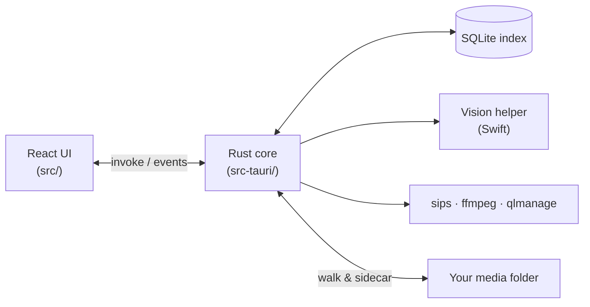

<div align="center">


# Trove

**A fast, native macOS app for browsing your local photos, videos, audio & PDFs — organized by the date they were captured.**

Point it at any folder or SSD. It indexes everything recursively into a date tree, understands your photos with on-device AI, and does it all **100% offline**.

<p>
  
  
  
  
  
  
  
</p>

</div>

---

Trove is built with **Tauri v2** (Rust core) + **React/TypeScript**, rendering in macOS's
native WebKit — so **HEIC photos and HEVC/`.mov` videos display without conversion**. Your
originals are never copied or modified; Trove only reads them and stores small derived data
(an index, thumbnails, embeddings).

> **Why it's different**
> - 🔒 **Private by design** — every feature, including scene/text/face analysis, runs on
>   your Mac. Nothing is uploaded, ever.
> - ⚡ **Built for scale** — a virtualized tree and a SQLite index handle tens of thousands
>   of files smoothly.
> - 🧳 **Portable libraries** — a folder can carry its own favorites, people names, and
>   analysis cache, so it opens instantly on another Mac with no re-analysis.
> - 🍎 **Actually native** — real macOS rendering, menus, and Vision — not a browser tab in
>   a window.

<!--
  📸 Screenshots welcome! Drop images into docs/ and reference them here, e.g.:
  <div align="center"></div>
-->

## ✨ Features

**Browse**
- 📅 **Date tree** — year → month → day → kind (Photos / Videos / Audio / PDFs), newest
  first, fully virtualized.
- 🎯 **Capture-accurate dates** — EXIF `DateTimeOriginal` for photos, `moov/mvhd` time for
  `.mp4`/`.mov`, with a modified-time fallback.
- 🗓️ **Calendar range picker** with smart presets (Today, Last 7/30 days, This/Last month
  or year, All time) plus a two-month range calendar.
- 🖼️ **Native preview pane** for images, video (with controls), audio, and PDFs, with
  `←`/`→` to cycle through assets.

**Understand** *(on-device, offline)*
- 🏷️ **Scenes & text (OCR)** — Apple Vision tags each photo (beach, food, document, …) for
  a Scene filter and recognizes text, so **search finds words inside screenshots and
  photos**.
- 🧑‍🤝‍🧑 **People** — faces are detected, quality-filtered, and clustered into people you can
  **name** and **merge** (drag one face onto another).
- 🌍 **Places** — photos are geolocated from EXIF GPS and reverse-geocoded **offline** into
  Country → City, shown on an offline world map with clustered pins.

**Filter & find**
- 🔎 **Combinable filters** — media type, favorites, camera, format, orientation, and scene
  labels all combine with the date range across the tree, lists, and search.
- ⭐ **Favorites** — star assets and filter to just those.
- 🔀 **Lens switcher** — browse the same filtered set by **Date**, **Places**, or **People**.

**Manage**
- ✏️ **Rename** inline (double-click a name), 🗑️ **delete** to Trash (reversible, with
  confirmation), and **Reveal in Finder**.
- 🧳 **Portable folder data** — favorites, names, and analysis live in a hidden `.trove/`
  folder inside your media folder (toggleable), so the library travels with the folder.
- ⌨️ **Full keyboard navigation** of the tree, search, and preview.

<details>
<summary><strong>⌨️ Keyboard shortcuts</strong></summary>

| Context | Keys |
| --- | --- |
| Tree | `↑`/`↓` move · `→`/`←` expand/collapse (or step in/out) · `Enter`/`Space` open · `Home`/`End` first/last |
| Search | `/` or `⌘F` focus · `↓`/`Enter` dive into results · `Esc` clear |
| Preview | `←`/`→` (or `↑`/`↓`) cycle prev/next asset (wraps) |
| App | `⌘O` open folder · `⌘,` settings |

Everything in the sidebar is reachable by `Tab` with visible focus rings.
</details>

## 🚀 Quick start

**Requirements:** macOS · [Node.js](https://nodejs.org/) 18+ · [Rust](https://rustup.rs/)
(stable) · Xcode Command Line Tools (for the Vision helper) · `ffmpeg` on `PATH`
(`brew install ffmpeg`). `sips` and `qlmanage` ship with macOS.

```bash
npm install
npm run app        # launch the app with hot reload (tauri dev)
```

Build a distributable:

```bash
npm run app:build  # .app + .dmg under src-tauri/target/release/bundle
```

## 🏗️ Architecture at a glance

A Rust core owns the filesystem, the SQLite index, and all heavy work; a React/TypeScript UI
renders in the native WebView and talks to it over Tauri IPC.



Full write-up in [docs/architecture.md](docs/architecture.md).

## 📚 Documentation

Deep dives on each subsystem live in [`docs/`](docs/):

| Topic | What's inside |
| --- | --- |
| [Architecture](docs/architecture.md) | Process model, data flow, module map, full IPC command catalog |
| [Indexing & capture dates](docs/indexing.md) | Supported formats, EXIF/MP4 date extraction, incremental re-scans, generations |
| [The index database](docs/database.md) | SQLite schema reference, storage locations, migrations |
| [Photo analysis](docs/analysis.md) | The Swift Vision helper — scenes, OCR, faces & people clustering |
| [Portable `.trove` sidecar](docs/portable-data.md) | How favorites, names & analysis travel with a folder |
| [Lenses, filters & places](docs/filters-and-lenses.md) | The lens switcher, filter framework, and offline geocoding/map |
| [Thumbnails & previews](docs/thumbnails.md) | Thumbnail/preview/face-crop generation and caching |
| [Contributing](docs/contributing.md) | Setup, tests, project layout, and extension points |

## 🔐 Where your data lives

- **Index + thumbnail cache** — `~/Library/Application Support/com.trove.app/`
  (`index.sqlite` + `thumbnails/`). Deleting it is a safe reset; your media is untouched.
- **Portable per-folder data** — a hidden `.trove/` folder *inside* your media folder
  (favorites, people names, analysis cache). Toggle it in Settings. See
  [docs/portable-data.md](docs/portable-data.md).

No account, no network, no telemetry.

## 🤝 Contributing

Issues and PRs are welcome — see [docs/contributing.md](docs/contributing.md) for setup,
tests, and where to plug in new features. Please run `cargo test` and `npx tsc --noEmit`
before submitting.

## 📄 License

Released under the [MIT License](LICENSE).
