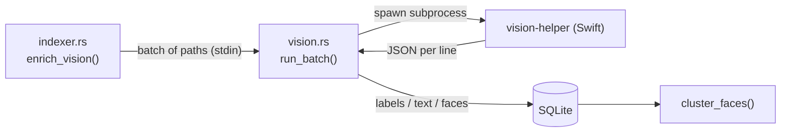

# Photo analysis — scenes, text & people

After indexing, Trove runs an **offline** analysis pass over photos using Apple's
[Vision](https://developer.apple.com/documentation/vision) framework. It produces three
things: **scene labels**, **recognized text (OCR)**, and **faces** grouped into people.
Nothing leaves your Mac.

## The Vision helper

Vision has no Rust bindings, so Trove ships a tiny Swift CLI —
`src-tauri/vision/vision-helper.swift` — compiled by `build.rs` (via `swiftc`) into
`bin/vision-helper` and bundled as a resource. If `swiftc` is unavailable at build time,
the build still succeeds and analysis is simply disabled.

It has two modes:

```
vision-helper <image-path>   # one JSON object for that image
vision-helper                # read paths on stdin, one per line;
                             # process concurrently, print one JSON line each
```

Batch (stdin) mode is what the app uses: the model loads once per batch and images are
processed with `DispatchQueue.concurrentPerform` across **all cores**. Each image is
decoded **downsampled** straight from disk via ImageIO (`MAX_DIM = 2560`), which is far
cheaper than fully decoding a 12MP+ photo and applies EXIF orientation for free.



`vision.rs::run_batch()` spawns the subprocess with a dedicated writer thread (feeding
stdin) and a reader (draining stdout) to avoid pipe deadlock, and parses one JSON object
per line back into Rust structs.

## Scene labels

`VNClassifyImageRequest` yields content labels (beach, food, document, dog, …) above a
confidence threshold. They're stored in `asset_labels` and power the **Scene** filter in
the Filters popover. Distinct labels for the current folder are surfaced by `get_facets`.

## Text recognition (OCR) → search

`VNRecognizeTextRequest` extracts text from each image into `assets.ocr`. Search then
matches your query against **both** file names and OCR text, so typing a word that appears
in a screenshot, sign, or document finds the photo. The recognition level is chosen by the
app through the `TROVE_OCR_MODE` environment variable:

- **accurate** (default) — most precise, slower.
- **fast** — much quicker, may miss small/low-contrast text.

Toggle it in **Settings → Photo analysis**; changing it clears `vision_done` and
re-analyzes in the background.

## Faces → people

Face handling is a pipeline of Vision requests, tuned to avoid junk clusters:

1. **Detect** — `VNDetectFaceRectanglesRequest` finds faces (group photos included).
2. **Quality-gate** — `VNDetectFaceCaptureQualityRequest` scores each; faces below `0.3`
   are dropped so blurry/tiny faces don't pollute clusters.
3. **Embed** — `VNGenerateImageFeaturePrintRequest` on each surviving face crop produces a
   768-dimension feature print (stored as a 3072-byte BLOB in `faces`).

### Clustering

`indexer.rs::cluster_faces()` does greedy, **incremental** clustering: each unclustered
face joins the nearest existing cluster within a **cosine distance ≤ 0.32**, or starts a
new one. Because it's incremental, analyzing new photos slots their faces into existing
people without recomputing everything.

The **People lens** then lets you:

- **Name** a cluster (double-click the name),
- **Merge** two clusters (drag one face card onto another) when Trove split the same person,
- **Browse** every photo a person appears in.

> **Best-effort recognition.** These are general-purpose Vision feature prints, not a
> dedicated face-recognition model, so grouping is approximate. The clustering threshold is
> a tunable constant, and merging is the manual escape hatch. A bundled face-tuned model is
> a natural future improvement.

### How names & groupings persist

Names are stored **twice**: as `people.name` (keyed by the current cluster id) and durably
in `named_faces` (keyed by file path + face position). After any re-index, `reattach_names()`
re-maps names to the freshly-formed clusters by matching face positions — so a name given
today survives re-analysis and even travels to another Mac via the
[portable sidecar](portable-data.md).
