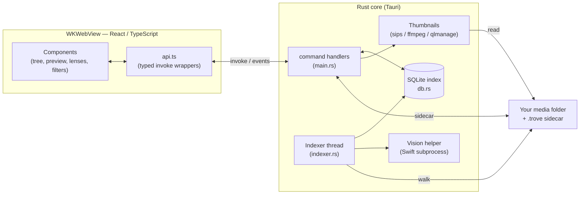
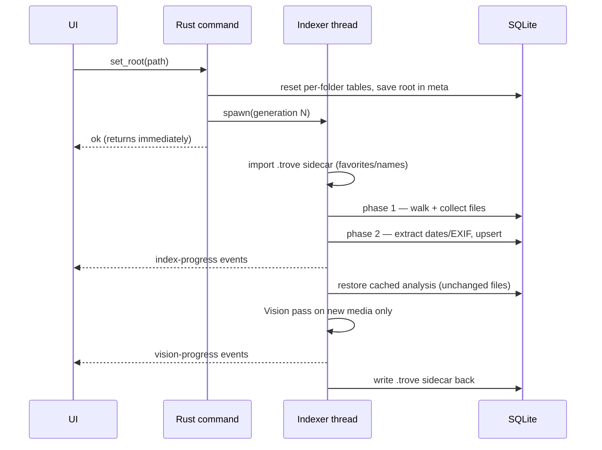

# Architecture

Trove is a [Tauri v2](https://v2.tauri.app/) desktop app: a **Rust** core that owns the
filesystem, the SQLite index, and all heavy work, paired with a **React + TypeScript**
UI rendered in macOS's native WebView (WKWebView). The two halves talk over Tauri's IPC
bridge — the UI never touches the disk directly; it asks the Rust side.

## Process model

| Piece | Where | Responsibility |
| --- | --- | --- |
| **UI** | `src/` | React components + state; renders the tree, preview, lenses, filters. Pure presentation + user intent. |
| **IPC layer** | `src/api.ts` | One typed async wrapper per backend command. The only place `invoke()` is called. |
| **Command handlers** | `src-tauri/src/main.rs` | ~25 `#[tauri::command]` functions. Own `AppState` (the DB connection, cache dir, current root, indexing generation). |
| **Indexer** | `src-tauri/src/indexer.rs` | Runs on a background thread with its *own* DB connection. Walks the folder, extracts metadata, drives the Vision pass. |
| **Vision helper** | `src-tauri/vision/vision-helper.swift` | A standalone Swift CLI invoked as a subprocess for scene labels, OCR, and faces. |

The Rust side and the indexer thread each open a separate `rusqlite::Connection` to the
same SQLite file (WAL mode + a busy timeout), so background indexing never blocks UI
queries.

## Data flow: opening a folder

The UI subscribes to progress **events** and re-queries the tree as they arrive, so
results stream in while indexing continues.

## Module map (Rust)

| Module | Role | Deep dive |
| --- | --- | --- |
| `main.rs` | App setup, `AppState`, native menu, all IPC command handlers | this doc |
| `db.rs` | SQLite connection + schema + migrations | [database.md](database.md) |
| `indexer.rs` | Walk, upsert, incremental re-scan, Vision enrichment, face clustering | [indexing.md](indexing.md) |
| `metadata.rs` | File-type classification + capture-date extraction (EXIF, MP4/MOV atoms) | [indexing.md](indexing.md) |
| `vision.rs` | Spawns & talks to the Swift Vision helper (batch protocol) | [analysis.md](analysis.md) |
| `places.rs` | Offline reverse-geocoding of GPS coordinates | [filters-and-lenses.md](filters-and-lenses.md) |
| `thumbs.rs` | Thumbnail / preview / face-crop generation + on-disk cache | [thumbnails.md](thumbnails.md) |
| `sidecar.rs` | The portable `.trove` folder (curation + analysis cache) | [portable-data.md](portable-data.md) |

## IPC command catalog

All commands are registered in `main.rs`'s `invoke_handler!` and wrapped in `src/api.ts`.

| Command | Purpose |
| --- | --- |
| `set_root` / `rescan` | Open a folder (starts indexing) / re-scan the current one |
| `get_date_tree` | Aggregated year→month→day→kind counts (honors the active filter) |
| `list_assets` | Assets for a given day/kind (or the whole filter) |
| `search_assets` | Name **or** OCR-text search across the index |
| `get_thumb` / `get_preview` / `get_face_thumb` | On-demand cached JPEG (returns a `data:`/asset URL) |
| `rename_asset` / `delete_asset` / `reveal_in_finder` | File operations (delete → Trash) |
| `get_recent_folders` / `remove_recent` / `get_quick_locations` | Welcome-screen data |
| `get_facets` | Distinct cameras / formats / scene labels for the Filters popover |
| `set_favorite` | Star / unstar an asset |
| `get_places` / `list_place_assets` | Places lens: country→city rollup + a place's assets |
| `get_people` / `list_person_assets` / `rename_person` / `merge_people` | People lens |
| `get_settings` / `set_vision_quality` / `set_store_in_folder` | Settings |

### Events (Rust → UI)

| Event | Payload | Meaning |
| --- | --- | --- |
| `index-progress` | `{ scanned, indexed, total, done }` | Walk/index progress |
| `vision-progress` | `{ processed, total, done }` | Scene/OCR/face analysis progress |
| `menu-open-folder` / `menu-settings` | – | Native menu items (⌘O / ⌘,) |

## Where things are stored

- **Central index + thumbnail cache** — `~/Library/Application Support/com.trove.app/`
  (`index.sqlite` + `thumbnails/`). See [database.md](database.md).
- **Portable per-folder data** — a hidden `.trove/` folder *inside* your media folder.
  See [portable-data.md](portable-data.md).

Original media is **never copied or modified** — Trove only reads it and stores metadata
and small derived files (thumbnails, embeddings).
