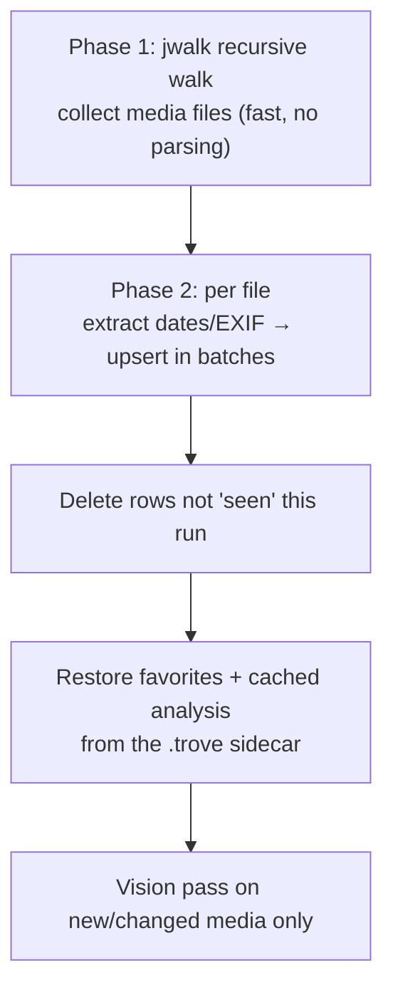

# Indexing & capture dates

The indexer turns a folder of files into the rows the UI queries. It runs on a background
thread (`indexer.rs`), streams progress events, and is safe to cancel and re-run.

## Supported media

`metadata.rs::classify()` maps a lowercase extension to one of four **kinds**; everything
else is ignored.

| Kind | Extensions |
| --- | --- |
| `image` | jpg, jpeg, jfif, png, gif, heic, heif, tif, tiff, bmp + RAW (dng, cr2/cr3, nef, arw, orf, rw2, raf, sr2, pef, nrw, …) |
| `video` | mp4, mov, m4v, avi, mkv, webm, wmv, flv, mpg, mpeg, 3gp, 3g2, m2ts, mts, ts |
| `audio` | mp3, m4a, aac, wav, flac, ogg, opus, alac, wma, aifc, … |
| `pdf` | pdf |

Because the WebView is native WebKit, **HEIC and HEVC/`.mov` render without conversion**.

## Capture-accurate dates

An asset is filed under the date it was *captured*, not when the file landed on disk.
`metadata.rs` resolves that with a fallback chain:

1. **Photos** — EXIF `DateTimeOriginal` (via `kamadak-exif`).
2. **Videos** — the `moov/mvhd` creation time, parsed directly from the MP4/MOV atom tree
   (`mp4_creation()`); QuickTime epoch (1904) is normalized to Unix.
3. **Fallback** — the file's modified time (`mtime`).

The resolved timestamp is split into `year` / `month` / `day` columns so the date tree is
a cheap `GROUP BY`.

EXIF extraction also pulls **camera make/model**, **pixel dimensions** (→ orientation), and
**GPS lat/lon** when present — these feed the Filters popover and the Places lens.

## The two-phase walk

- **Phase 1** uses [`jwalk`](https://docs.rs/jwalk) with `skip_hidden(true)` (so `.trove`
  and other dotfiles are ignored) to gather candidate files quickly.
- **Phase 2** extracts metadata and upserts rows in batched transactions, emitting
  `index-progress` as it goes.

## Incremental re-scans

Re-opening a folder (or `rescan`) does **not** rebuild from scratch:

- **`mtime` fast-path** — if a file's modified time is unchanged from the stored row, its
  metadata extraction is skipped; the row is just marked *seen* for this run.
- **Generations** — every index run gets a monotonically increasing generation number
  (`AtomicU64`). If the user opens another folder mid-scan, the generation bumps and the
  old run notices it's *superseded* and exits cleanly — no orphaned writes.
- **`seen` sweep** — after the walk, rows not touched this generation are deleted, so files
  removed on disk disappear from the index.
- **`INDEX_VER`** — a schema/extraction version constant (currently `3`). When it changes,
  the next run forces a one-time full re-extract so new columns get populated for existing
  libraries.

## What the Vision pass adds

After the walk, `enrich_vision()` runs scene/OCR/face analysis on images that aren't
already analyzed (`vision_done = 0`) — but only after the sidecar has restored any cached
results for unchanged files, so **only genuinely new or changed media is analyzed**. See
[analysis.md](analysis.md) and [portable-data.md](portable-data.md).

## Related

- Schema the indexer writes to → [database.md](database.md)
- Cache that lets it skip work → [portable-data.md](portable-data.md)
