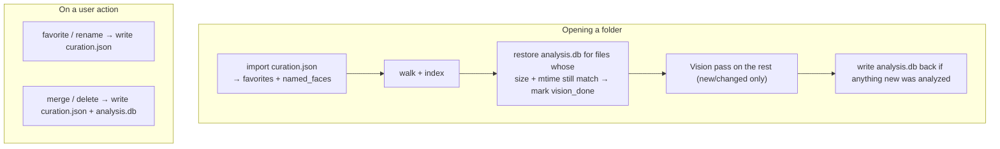

# Portable folder data — the `.trove` sidecar

By default, a media folder **carries its own Trove data**. Favorites, people names, and the
full analysis cache are written into a hidden `.trove/` folder *inside* your media folder,
keyed by paths **relative** to that folder. Copy the folder to an external drive or another
Mac, open it in Trove, and everything is restored — with **no re-analysis** of unchanged
photos. Implemented in `sidecar.rs`.

## What's on disk

```
<your media folder>/.trove/
├── curation.json    # favorites + face names (small, plain text)
└── analysis.db      # scene labels, OCR, faces (box + cluster + embedding)
```

Two files, split by how precious and how large the data is:

| File | Format | Holds | Why this format |
| --- | --- | --- | --- |
| `curation.json` | JSON | favorites, face names | Small and irreplaceable user intent. Plain text is diffable, merge-friendly, atomically written, and safe on cloud drives. Kept separate so a damaged cache never risks it. |
| `analysis.db` | SQLite | scene labels, OCR text, faces (box, cluster, 3072-byte embedding) | ~50 MB of binary embeddings for a large library — base64-in-JSON would bloat and be slow. SQLite stores blobs compactly and updates a merge with a cheap `UPDATE`. Rollback-journal mode → a single self-contained file that copies/syncs cleanly. |

Everything is keyed by **path relative to the folder root**, so it stays valid when the
folder moves or opens on another machine.

## How it fits with the central index

The [central SQLite index](database.md) is still the fast working store. The sidecar is the
**portable source of truth** that seeds it:



- **Reads always happen** (importing/restoring an existing sidecar is harmless).
- **Writes are gated** by the *Store data inside the folder* setting and happen **off the UI
  thread** (a spawned connection), so toggling a favorite never blocks.
- **Skip-analysis rule:** a cached record is reused only when the file's `size` **and**
  `mtime` still match. Any change → the file is re-analyzed and the cache updated.

## Behavior & trade-offs

- **Read-only volumes** (locked SSD, network share): sidecar writes fail silently; the
  central index still holds everything, so nothing breaks — you just don't get portability
  on that volume.
- **Favorites are exact across machines** (path-only key). **Face names are best-effort** —
  they reattach by matching the face box, which can drift slightly across macOS/Vision
  versions; stored embeddings + clusters keep groupings intact regardless.
- **Privacy:** names travel *with* the folder, so sharing the folder shares who you've
  tagged. The Settings toggle text calls this out.
- **`.trove/` appears after the first analysis** — that's the feature; it's what makes
  re-analysis skippable and the folder portable.
- **The cache is rebuilt in full** (in the background) on merges/deletes. Fine at this
  scale; a natural spot for an incremental optimization later.

## Turning it off

**Settings → Portable data → Store data inside the folder.** Off keeps everything on this
Mac only (the central index behaves exactly as before this feature). An existing sidecar is
still *read* when present; only writing is disabled.

## Design notes

- `sidecar.rs` is covered by a round-trip test: export on "machine A" → restore into a fresh
  DB ("machine B") and assert favorites, OCR, labels, face clusters, and names all come back,
  and that a changed `mtime` correctly forces re-analysis.
- Atomic JSON writes use a per-write unique temp filename so overlapping favorite toggles
  can't clobber each other before the rename.
