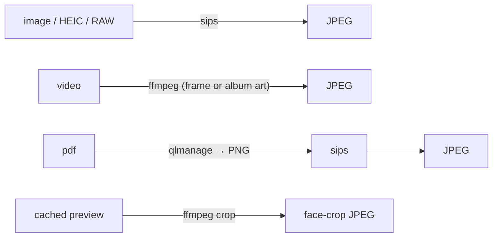

# Thumbnails & previews

Trove renders originals natively in the preview pane (WebKit handles HEIC/HEVC), but grids
and stepping through photos need cheap, uniform images. `thumbs.rs` generates three kinds of
derived JPEGs on demand and caches them on disk.

## The three sizes

| Kind | Command | Used for |
| --- | --- | --- |
| **Thumbnail** | `get_thumb(path, size)` | grid tiles (small) |
| **Preview** | `get_preview(path)` | the preview pane — a screen-sized (2560px) image so stepping doesn't re-decode the full original each time |
| **Face crop** | `get_face_thumb(path, box, size)` | People lens — a square crop of a face, cut from the cached preview |

Each returns a path that the UI turns into a webview-loadable URL via
`convertFileSrc()`; `null` means no thumbnail could be produced for that file type.

## How each type is produced

- **Images (incl. HEIC & RAW)** — downscaled with macOS **`sips`**.
- **Video** — a representative frame (or embedded album art) grabbed with **`ffmpeg`**.
- **PDF** — rendered to PNG by **`qlmanage`** (QuickLook), then converted to JPEG with `sips`.
- **Face crop** — the asset's cached 2560px preview is cropped to the face box with `ffmpeg`,
  so face thumbnails don't re-decode the original.

`ffmpeg` must be on `PATH` (`brew install ffmpeg`); `sips` and `qlmanage` ship with macOS.

## The cache

Cached files live in `~/Library/Application Support/com.assetsviewer.app/thumbnails/`.

The cache key is **file path + modified time + size** (`thumb_file()`), so:

- editing or replacing a file (which changes its `mtime`) transparently regenerates its
  thumbnail — no stale images;
- re-opening a folder reuses everything already generated, so it's instant.

The cache is pure derived data: deleting the `thumbnails/` directory just means images
regenerate on next view.
